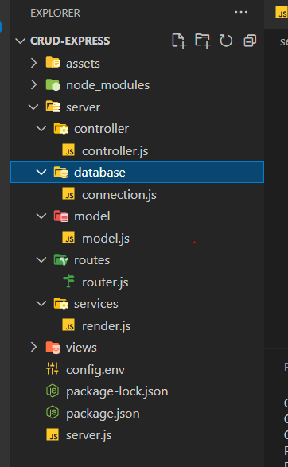

# Cách sử dụng node js để tạo một server

## Khởi tạo:

1. **yarn init**: khởi tạo file **package.json**;
2. **yarn add express**: cài đặt thư viện **express**;
3. Tạo file **index.js** cùng cấp với **package.json**;
4. Dán đoạn code này vào: **index.js**;

```js
const express = require("express");
const app = express();
const port = 3000;

app.get("/", (req, res) => {
  res.send("Hello World!");
});

app.listen(port, () => {
  console.log(`Example app listening on port ${port}`);
});
```

5. **node index.js** Chạy thử server lên;
6. **yarn add nodemon**: cài thư viện này giúp tự động restart lại app khi có sự thay đổi trong dự án
7. Thêm đoạn code này vào sửa **package.json**

```js
  "scripts": {
    "start": "nodemon index.js"
  },
```

8. **yarn start** : Chạy server thông qua thư viện **nodemon** , bây giờ khi thay đổi file bất kỳ trong dự án thì sẽ tự động refresh lại server.
9. **yarn add morgan** : Cài đặt thư viện này giúp xem được **log** những resquest được gửi lên server.

- Sau đó import vào và sử dụng:

```js
const express = require("express");
const morgan = require("morgan"); // here
const app = express();
const port = 3000;

app.use(morgan("tiny")); // here

app.get("/", (req, res) => {
  res.send("Hello Worlf!");
});

app.listen(port, () => {
  console.log(`Example app listening on port ${port}`);
});
```

## Chỉnh lại cấu trúc thư mục

1. Tạo thư mục **src**: cùng cấp với **node_modules**:
2. Lôi file **index.js** vào thư mục **src**;
3. Chỉnh sửa lại file **package.json**

```js
  {
  "name": "backend",
  "version": "1.0.0",
  "main": "src/index.js", // here
  "author": "hungmanh",
  "license": "MIT",
  "scripts": {
    "start": "nodemon src/index.js" // here
  },
  "dependencies": {
    "express": "4.18.1",
    "morgan": "^1.10.0",
    "nodemon": "2.0.16"
  }
}
```

4. Tạo thư mục **app** trong **src** cùng cấp với index.js : trong đó sẽ chứa các thư mục sau: **controllers** ,**middleware**,..
5. Tạo thư mục: **model** trong **src** cùng cấp với index.js: trong đó sẽ chứa file **model.js** sẽ chứa các **schema**
6. Tạo thư mục: **router** trong **src** cùng cấp với index.js: trong đó sẽ chứa file **router.js**
7. Tạo thư mục: **database** trong **src** cùng cấp với index.js: trong đó sẽ chứa file **connection.js**
   

## Thay đổi router
